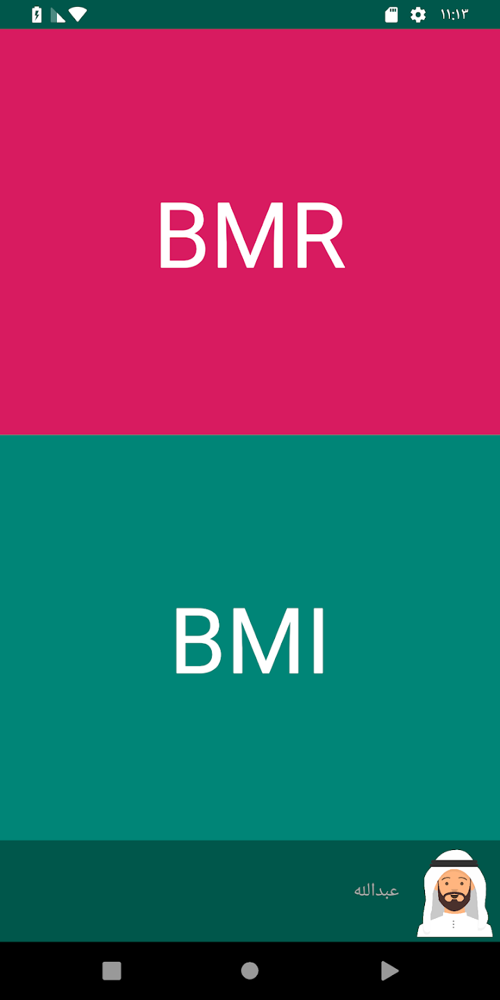
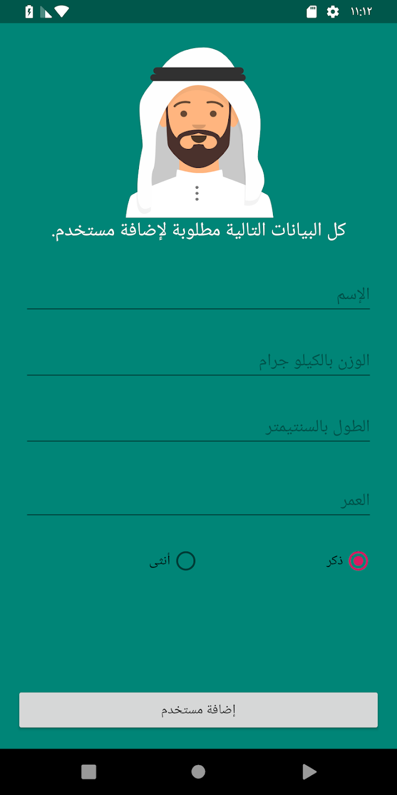
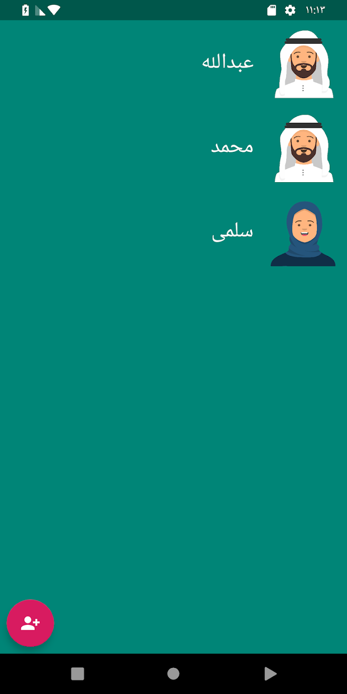
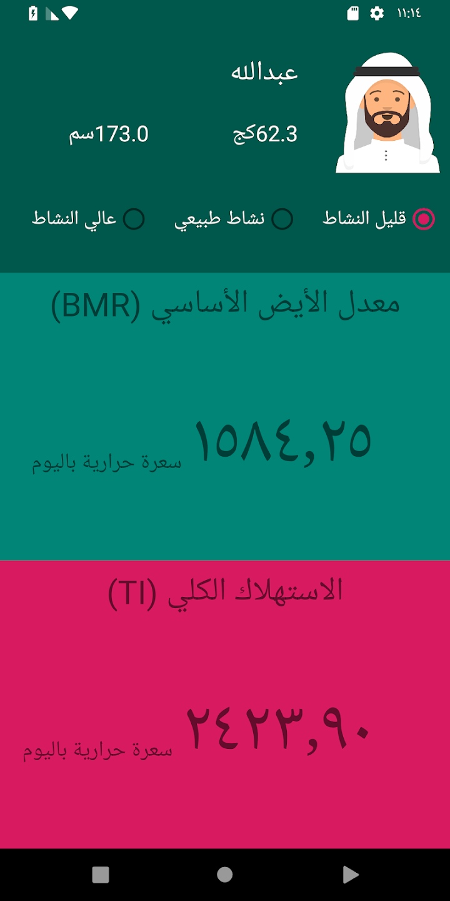

# Healthy Family Android App (Base)

This is the repository for the Healthy Family app that students used to learn TDD in [the Android Degree at Barmej.com](https://www.barmej.com/degree/android)

This app is a simple Android app that helps the family to maintain the health of its members, by knowing simple details about the weight and length of each individuals.
BMR and BMI can be calculated for each individual to prevent over-fed and maintain health.

By building this app, students will learn about new topic called "Test Driven Development (TDD)"

To use this repository, fork/clone it, or download a zip using the green "Clone or download" button at the top of the file list. 

# Screenshots
   

# Contributing
All contributions are welcome and gratefully accepted.

# License

A copy of the license is also available in the [license file](LICENSE).

# Demo

